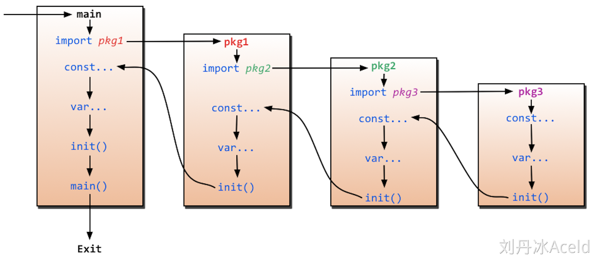

# 开发环境
- [Go开发环境](https://www.yuque.com/aceld/mo95lb/haizwm)

## 下载配置 Golang

## 配置 Visual Studio Code

## 配置环境变量
- [GoRoot 和 GoPath 有什么用](https://golang.design/go-questions/compile/gopath/)


---


# 包管理
- [【Go语言专栏】理解Go语言的包管理机制](https://developer.aliyun.com/article/1498061?scm=20140722.ID_community%40%40article%40%401498061._.ID_community%40%40article%40%401498061-OR_rec-PAR1_0b14c2ae17439316372316656e27c8-V_1-RL_community%40%40article%40%401486999)
- [go包管理速通，一篇文章就够了，再也不用担心因为不会导包被辞退](https://developer.aliyun.com/article/1151783)
- [Go Modules](https://www.yuque.com/aceld/mo95lb/ovib08)
- [使用go module导入本地包](https://zhuanlan.zhihu.com/p/109828249)
- [go语言基础之包和自定义包与main包](https://www.cnblogs.com/nulige/p/10233750.html)
- [【Go 基础篇】Go语言包详解：模块化开发与代码复用](https://cloud.tencent.com/developer/article/2339092)

## GoPath/GoVendor

## GoModule —— 从建立 test.go 开始

> [理解 go mod init 命令](https://www.cnblogs.com/abclife/p/18096182)

1. 在目标目录建立一个新文件夹

2. 使用命令行在当前目录下输入如下指令
    ```bash
    $ go mod init 模块名
    ```
    - 实际可以为 `go mod init 所属网站.com/作者/module名`，这样命名有助于标识

3. 会产生一个新文件 `go.mod`，
    - 包括如下内容
        - 模块路径
        - Go 的版本信息
        - 依赖信息
    - 该文件是当前路径下所有 `package` 的集合标识，一个文件夹（包括子文件夹）只能有一个
    - 示例如下：
        ```go
        // 使用 module 标记当前库所编译出来的模块名
        module example.com/myproject

        // go 版本
        go 1.17

        // 依赖包的声明
        require (

        )
        ```

4. 建立新文件夹和其中文件 `./main/test.go`
    ```go
    // 使用 package 标记当前所属包的名字
    package main

    // 导入的模块名，这里的中括号在单引用时可以省略
    import{
        "fmt"   // 直接导入本地包
        "go.mod所在路径(根目录)/子package包体名" as "简写" //可以使用 as 进行别名指定，
    }

    // 每一个module都需要有一个 main() 函数
    func main() {
        /* 简单的程序 万能的hello world */
        fmt.Println("Hello Go") // 使用 fmt 模块(module)中的函数
    }
    ```
    - 在Go语言中，一个目录下的所有Go源文件必须属于同一个包
        - 即同一个目录下的文件必须声明相同的包名。
        - 包名通常与目录名相同。
    - 应该全小写字母，可以使用_进行分割

5. 运行方法：
    - 直接编译并运行
        ```bash
        $ go run test.go
        ```
    - 先编译后执行
        ```bash
        $ go build test.go 
        $ ./test
        Hello Go
        ```

6. 导入其他非本地包体
    1. 修改 `main.go` 文件
        ```go
        import{
            // 原有包，比如之前导入的 "fmt"
            
            "example.com/作者名/模块名/包体名"   // 通过这种方式来导入指定模块的指定包
        }
        ```
    2. 然后在 module 所在目录下，执行以下命令行指令
        ```bash
        $ go get example.com/作者名/模块名
        ```
    3. 检查 `go.mod` 文件，发现 `require` 部分修改如下
        ```go.mod
        require (
            // ... 默认应该无内容
            example.com/作者名/模块名 版本标识    // indirect
        )
        ```
        - 其中版本标识有两种
            - 打了版本tag标记的第三方库，显示 `v版本号`
            - 未打标记的，显示 `v0.0.0-时间串-标识串`
        - 其中 `// indirect` 标记说明为「间接依赖」
            - 在当前应用程序的 `import` 语句中，没有发现该模块明确引用
            - 可能是只使用 `go get` 拉取但未使用
            - 也可能是使用了他的子包体，比如上面 `main.go` 中的 `example.com/作者名/模块名/包体名`
    4. 会产生文件 `go.sum`
        - 其详细罗列了当前项目直接或间接依赖的所有模块版本
        - 并写明了那些模块版本的 SHA-256 哈希值
        - 以备 Go 在今后的操作中保证项目所依赖的那些模块版本不会被篡改。

## package 相关
- 在 Go 中，程序是通过将包链接在一起来构建的。
- Go 中进行导入的最基本单位是一个包，而不是.go文件。
- 包其实就是一个文件夹，英文名 package，包内共享所有变量，常量，以及所有定义的类型。
    - 控制可见性的方法
        - 名称大写字母开头，即为公有类型/变量/常量
        - 名字小写或下划线开头，即为私有类型/变量/常量
    - 如果有一个包名为 `internal`，那么它是「内部包」
        - 外部包无法访问内部包的任何内容，否则编译不通过
- 包的命名风格建议都是小写字母，并且要尽量简短。

## 启动与引用
- golang里面有两个保留的函数：
    - init函数（能够应用于所有的package）
    - main函数（只能应用于package main）。
    - 这两个函数在定义时不能有任何的参数和返回值。
- 虽然一个package里面可以写任意多个init函数
    - 但这无论是对于可读性还是以后的可维护性来说
    - 强烈建议在一个package中每个文件只写一个init函数。
- go程序会自动调用init()和main()，所以你不需要在任何地方调用这两个函数。
- 每个package中的init函数都是可选的，但package main就必须包含一个main函数。

- 程序的初始化和执行都起始于main包。
    1. 如果main包还导入了其它的包，那么就会在编译时将它们依次导入。
        - 有时一个包会被多个包同时导入，那么它只会被导入一次
        - 例如很多包可能都会用到fmt包，但它只会被导入一次，因为没有必要导入多次
    2. 当一个包被导入时，如果该包还导入了其它的包，那么会先将其它包导入进来，然后再对这些包中的包级常量和变量进行初始化，接着执行init函数（如果有的话），依次类推。
    3. 等所有被导入的包都加载完毕了，就会开始对main包中的包级常量和变量进行初始化，然后执行main包中的init函数（如果存在的话），最后执行main函数。




---


# 特性
1. 优势
    - 部署简单：可编译成机器码、不依赖其他库、直接运行即可部署
    - 静态类型：编译时检查大多数问题
    - 语言层面并发：设计时即支持、充分利用多核
    - 标准库强大：运行时系统调度、高效GC回收、标准库丰富
    - 简单易学：25关键字、内嵌C语法支持、面向对象支持（继承/多态/封装）、跨平台
2. 适用领域：
    - 云计算基础设施
    - 基础后端软件
    - 微服务
    - 互联响基础设施
3. 不足：
    - 包管理没有提供明确方案、大多数都需要依赖 github 下载
    - 所有异常均用 Error 处理
    - 对 C 降级处理有序列化问题


---


# 格式、注释、语法

## 从 main 函数看 Golang 格式
`main.go` 文件如下：
```go
package main

import{
    "fmt"
}

// 函数名后的左大括号必须同行
func main() {
    /* 跨行注释，或者称为块注释
    一般用于包的文档描述或注释成块的代码片段 */
    fmt.Println("Hello Go") // 单行注释
}
```

## 注释即文档
- 参考[作为 Gopher，你知道 Go 的注释即文档应该怎么写吗？](https://segmentfault.com/a/1190000041604192)

## 标识符
- 只能由字母，数字，下划线组成
- 只能以字母和下划线开头
- 严格区分大小写
- 不能与任何已存在的标识符重复，即**包内唯一**的存在
- 不能与 Go 任何内置的关键字冲突
    ```go
    break        default      func         interface    select
    case         defer        go           map          struct
    chan         else         goto         package      switch
    const        fallthrough  if           range        type
    continue     for          import       return       var
    ```

## 运算符
- 优先级

| Precedence | Operator       |
|------------|----------------|
| 5          | *  /  %  <<  >> & &^ |
| 4          | +  -  |  ^           |
| 3          | ==  !=  <  <=  >  >=  |
| 2          | &&                   |
| 1          | ||                   |

- 通过复用 `^` 来作为取反符
    - 不使用 `~`
    - 对两个数字间使用时，作为异或运算符（**不是次方运算**）
    - 在数字前单独使用时，则是取反运算符

- 没有自增/自减运算符
    - 降级为语句，只能在操作数后方，如 `a++`/`b--`
    - 不具有返回值，不能如 `a=b++` 这样用

## 风格
- 提供官方风格化工具 `gofmt`

- 函数花括号
    - 左括号 `{` 必须同行，否则编译失败
    - 使用 `Tab` 制表符缩进，特殊情况下空格
    - 格式化后的代码间隔有意义
    - 不能省略花括号
    - 没有三元表达式
