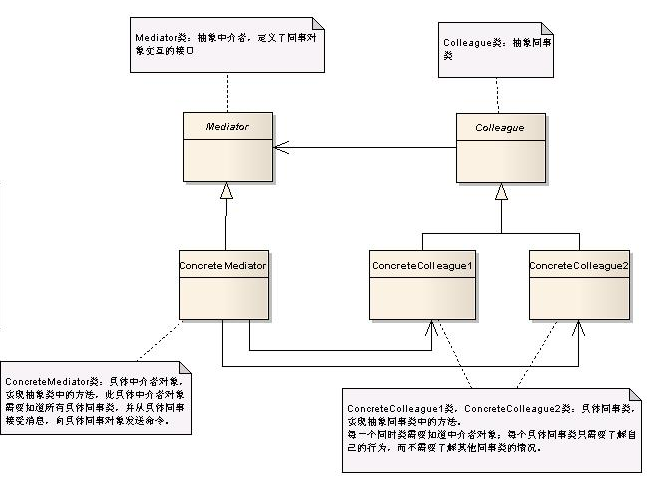

## 介绍
- 定义了一个中介对象来封装一系列对象之间的交互关系。
- 中介者使各个对象之间不需要显式地相互引用，从而使耦合性降低，而且可以独立地改变它们之间的交互行为。


## 例子

### 默认实现
- 使用了抽象类使具体牌友A和牌友B都依赖于抽象类，从而降低了同事类之间的耦合度

```cs
// A,B两个人打牌
void Invoke_default()
{
    AbstractCardPartner A = new ParterA();
    A.MoneyCount = 20;
    AbstractCardPartner B = new ParterB();
    B.MoneyCount = 20;

    // A 赢了则B的钱就减少
    A.ChangeCount(5, B);
    Console.WriteLine("A 现在的钱是：{0}", A.MoneyCount);// 应该是25
    Console.WriteLine("B 现在的钱是：{0}", B.MoneyCount); // 应该是15

    // B赢了A的钱也减少
    B.ChangeCount(10, A);
    Console.WriteLine("A 现在的钱是：{0}", A.MoneyCount); // 应该是15
    Console.WriteLine("B 现在的钱是：{0}", B.MoneyCount); // 应该是25
    Console.Read();
}


// 抽象牌友类
public abstract class AbstractCardPartner
{
    public int MoneyCount { get; set; }

    public AbstractCardPartner()
    {
        MoneyCount = 0;
    }

    public abstract void ChangeCount(int Count, AbstractCardPartner other);
}


#region
// 牌友A类
public class ParterA : AbstractCardPartner
{
    public override void ChangeCount(int Count, AbstractCardPartner other)
    {
        this.MoneyCount += Count;
        other.MoneyCount -= Count;
    }
}
// 牌友B类
public class ParterB : AbstractCardPartner
{
    public override void ChangeCount(int Count, AbstractCardPartner other)
    {
        this.MoneyCount += Count;
        other.MoneyCount -= Count;
    }
}
#endregion
```

### 使用中介模式
- 原有实现的问题：
    - 如果其中牌友A发生变化时，此时就会影响到牌友B的状态
    - 如果涉及的对象变多的话，这时候某一个牌友的变化将会影响到其他所有相关联的牌友状态。
        - 例如牌友A算错了钱，这时候牌友A和牌友B的钱数都不正确了
    - 如果是多个人打牌的话，影响的对象就会更多。
- 这时候就会思考——能不能把算钱的任务交给程序或者算数好的人去计算呢
    - 这时候就有了我们QQ游戏中的欢乐斗地主等牌类游戏了。
- 加入一个中介者对象来协调各个对象之间的关联，这也就是中介者模式的应用了

```cs
void Invoke_Mediator()
{
    AbstractCardPartner A = new ParterA();
    AbstractCardPartner B = new ParterB();
    // 初始钱
    A.MoneyCount = 20;
    B.MoneyCount = 20;

    AbstractMediator mediator = new MediatorPater(A, B);

    // A赢了
    A.ChangeCount(5, mediator);
    Console.WriteLine("A 现在的钱是：{0}", A.MoneyCount);// 应该是25
    Console.WriteLine("B 现在的钱是：{0}", B.MoneyCount); // 应该是15

    // B 赢了
    B.ChangeCount(10, mediator);
    Console.WriteLine("A 现在的钱是：{0}", A.MoneyCount);// 应该是15
    Console.WriteLine("B 现在的钱是：{0}", B.MoneyCount); // 应该是25
    Console.Read();
}


#region 中介器
// 抽象中介者类
public abstract class AbstractMediator
{
    protected AbstractCardPartner A;
    protected AbstractCardPartner B;
    public AbstractMediator(AbstractCardPartner a, AbstractCardPartner b)
    {
        A = a;
        B = b;
    }

    public abstract void AWin(int count);
    public abstract void BWin(int count);
}

// 具体中介者类
public class MediatorPater : AbstractMediator
{
    public MediatorPater(AbstractCardPartner a, AbstractCardPartner b)
        : base(a, b)
    {
    }

    public override void AWin(int count)
    {
        A.MoneyCount += count;
        B.MoneyCount -= count;
    }

    public override void BWin(int count)
    {
        B.MoneyCount += count;
        A.MoneyCount -= count;
    }
}
#endregion


#region 中介对象
// 抽象牌友类
public abstract class AbstractCardPartner
{
    public int MoneyCount { get; set; }

    public AbstractCardPartner()
    {
        MoneyCount = 0;
    }

    public abstract void ChangeCount(int Count, AbstractMediator mediator);
}
// 牌友A类
public class ParterA : AbstractCardPartner
{
    // 依赖与抽象中介者对象
    public override void ChangeCount(int Count, AbstractMediator mediator)
    {
        mediator.AWin(Count);
    }
}
// 牌友B类
public class ParterB : AbstractCardPartner
{
    // 依赖与抽象中介者对象
    public override void ChangeCount(int Count, AbstractMediator mediator)
    {
        mediator.BWin(Count);
    }
}
#endregion
```


## 总结



1. 抽象中介者角色中则需要保存各个对象的引用
2. 中介者类是起到协调各个对象的作用
3. 抽象同事类
4. 具体同事类

- 优点
    1. 简化了对象之间的关系，将系统的各个对象之间的相互关系进行封装，将各个同事类解耦，使得系统变为松耦合。
    2. 提供系统的灵活性，使得各个同事对象独立而易于复用。
- 缺点
    1. 中介者模式中，中介者角色承担了较多的责任，所以一旦这个中介者对象出现了问题，整个系统将会受到重大的影响。
        - 例如，QQ游戏中计算欢乐豆的程序出错了，这样会造成重大的影响。
    2. 新增加一个同事类时，不得不去修改抽象中介者类和具体中介者类
        - 此时可以使用观察者模式和状态模式来解决这个问题。
