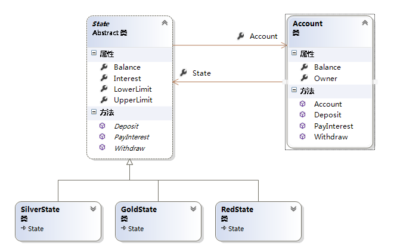

## 介绍
- 允许一个对象在其内部状态改变时自动改变其行为，对象看起来就像是改变了它的类。
- 状态模式将每种状态对应的行为抽象出来成为单独新的对象，这样状态的变化不再依赖于对象内部的行为。

- 面对场景：
    - 每个对象都有其对应的状态，而每个状态又对应一些相应的行为
        - 如果某个对象有多个状态时，那么就会对应很多的行为。
    - 对这些状态的判断和根据状态完成的行为，就会导致多重条件语句
        - 并且如果添加一种新的状态时，需要更改之前现有的代码。
    - 这样的设计显然违背了开闭原则。

## 例子
- 银行账户根据余额可分为RedState、SilverState和GoldState。
    - 这些状态分别代表透支账号，新开账户和标准账户。
- 账号余额在【-100.0，0.0】范围表示处于RedState状态
- 账号余额在【0.0 ， 1000.0】范围表示处于SilverState
- 账号在【1000.0， 100000.0】范围表示处于GoldState状态。

### 状态模式
```cs
void Invoke_Oure_State(string[] args)
{
    // 开一个新的账户
    Account account = new Account("Learning Hard");

    // 进行交易
    // 存钱
    account.Deposit(1000.0);
    account.Deposit(200.0);
    account.Deposit(600.0);

    // 付利息
    account.PayInterest();

    // 取钱
    account.Withdraw(2000.00);
    account.Withdraw(500.00);

    // 等待用户输入
    Console.ReadKey();
}


// 账户类
public class Account
{
    public State State { get; set; }
    public string Owner { get; set; }
    public Account(string owner)
    {
        this.Owner = owner;
        this.State = new SilverState(0.0, this);
    }

    // 余额
    public double Balance { get { return State.Balance; } }

    // 存钱
    public void Deposit(double amount)
    {
        State.Deposit(amount);
        Console.WriteLine("存款金额为 {0:C}——", amount);
        Console.WriteLine("账户余额为 =:{0:C}", this.Balance);
        Console.WriteLine("账户状态为: {0}", this.State.GetType().Name);
        Console.WriteLine();
    }

    // 取钱
    public void Withdraw(double amount)
    {
        State.Withdraw(amount);
        Console.WriteLine("取款金额为 {0:C}——", amount);
        Console.WriteLine("账户余额为 =:{0:C}", this.Balance);
        Console.WriteLine("账户状态为: {0}", this.State.GetType().Name);
        Console.WriteLine();
    }

    // 获得利息
    public void PayInterest()
    {
        State.PayInterest();
        Console.WriteLine("Interest Paid --- ");
        Console.WriteLine("账户余额为 =:{0:C}", this.Balance);
        Console.WriteLine("账户状态为: {0}", this.State.GetType().Name);
        Console.WriteLine();
    }
}


// 抽象状态类
public abstract class State
{
    // Properties
    public Account Account { get; set; }
    public double Balance { get; set; } // 余额
    public double Interest { get; set; } // 利率
    public double LowerLimit { get; set; } // 下限
    public double UpperLimit { get; set; } // 上限

    public abstract void Deposit(double amount); // 存款
    public abstract void Withdraw(double amount); // 取钱
    public abstract void PayInterest(); // 获得的利息
}

#region 具体状态类
// Red State意味着Account透支了
public class RedState : State
{
    public RedState(State state)
    {
        // Initialize
        this.Balance = state.Balance;
        this.Account = state.Account;
        Interest = 0.00;
        LowerLimit = -100.00;
        UpperLimit = 0.00;
    }

    // 存款
    public override void Deposit(double amount)
    {
        Balance += amount;
        StateChangeCheck();
    }
    // 取钱
    public override void Withdraw(double amount)
    {
        Console.WriteLine("没有钱可以取了！");
    }

    public override void PayInterest()
    {
        // 没有利息
    }

    private void StateChangeCheck()
    {
        if (Balance > UpperLimit)
        {
            Account.State = new SilverState(this);
        }
    }
}

// Silver State意味着没有利息得
public class SilverState : State
{
    public SilverState(State state)
        : this(state.Balance, state.Account)
    {
    }

    public SilverState(double balance, Account account)
    {
        this.Balance = balance;
        this.Account = account;
        Interest = 0.00;
        LowerLimit = 0.00;
        UpperLimit = 1000.00;
    }

    public override void Deposit(double amount)
    {
        Balance += amount;
        StateChangeCheck();
    }
    public override void Withdraw(double amount)
    {
        Balance -= amount;
        StateChangeCheck();
    }

    public override void PayInterest()
    {
        Balance += Interest * Balance;
        StateChangeCheck();
    }

    private void StateChangeCheck()
    {
        if (Balance < LowerLimit)
        {
            Account.State = new RedState(this);
        }
        else if (Balance > UpperLimit)
        {
            Account.State = new GoldState(this);
        }
    }
}


// Gold State意味着有利息状态
public class GoldState : State
{
    public GoldState(State state)
    {
        this.Balance = state.Balance;
        this.Account = state.Account;
        Interest = 0.05;
        LowerLimit = 1000.00;
        UpperLimit = 1000000.00;
    }
    // 存钱
    public override void Deposit(double amount)
    {
        Balance += amount;
        StateChangeCheck();
    }
    // 取钱
    public override void Withdraw(double amount)
    {
        Balance -= amount;
        StateChangeCheck();
    }
    public override void PayInterest()
    {
        Balance += Interest * Balance;
        StateChangeCheck();
    }

    private void StateChangeCheck()
    {
        if (Balance < 0.0)
        {
            Account.State = new RedState(this);
        }
        else if (Balance < LowerLimit)
        {
            Account.State = new SilverState(this);
        }
    }
}
#endregion
```

### 使用中介和状态
```cs
void Invoke_State_Mediator(string[] args)
{
    AbstractCardPartner A = new ParterA();
    AbstractCardPartner B = new ParterB();
    // 初始钱
    A.MoneyCount = 20;
    B.MoneyCount = 20;

    AbstractMediator mediator = new MediatorPater(new InitState());

    // A,B玩家进入平台进行游戏
    mediator.Enter(A);
    mediator.Enter(B);

    // A赢了
    mediator.State = new AWinState(mediator);
    mediator.ChangeCount(5);
    Console.WriteLine("A 现在的钱是：{0}", A.MoneyCount);// 应该是25
    Console.WriteLine("B 现在的钱是：{0}", B.MoneyCount); // 应该是15

    // B 赢了
    mediator.State = new BWinState(mediator);
    mediator.ChangeCount(10);
    Console.WriteLine("A 现在的钱是：{0}", A.MoneyCount);// 应该是25
    Console.WriteLine("B 现在的钱是：{0}", B.MoneyCount); // 应该是15
    Console.Read();
}


#region 中介器
// 抽象中介者类
public abstract class AbstractMediator
{
    public List<AbstractCardPartner> list = new List<AbstractCardPartner>();

    public State State { get; set; }

    public AbstractMediator(State state)
    {
        this.State = state;
    }

    public void Enter(AbstractCardPartner partner)
    {
        list.Add(partner);
    }

    public void Exit(AbstractCardPartner partner)
    {
        list.Remove(partner);
    }

    public void ChangeCount(int count)
    {
        State.ChangeCount(count);
    }
}

// 具体中介者类
public class MediatorPater : AbstractMediator
{
    public MediatorPater(State initState)
        : base(initState)
    { }
}
#endregion

// 抽象牌友类
public abstract class AbstractCardPartner
{
    public int MoneyCount { get; set; }

    public AbstractCardPartner()
    {
        MoneyCount = 0;
    }

    public abstract void ChangeCount(int Count, AbstractMediator mediator);
}

#region 具体牌友类
// 牌友A类
public class ParterA : AbstractCardPartner
{
    // 依赖与抽象中介者对象
    public override void ChangeCount(int Count, AbstractMediator mediator)
    {
        mediator.ChangeCount(Count);
    }
}

// 牌友B类
public class ParterB : AbstractCardPartner
{
    // 依赖与抽象中介者对象
    public override void ChangeCount(int Count, AbstractMediator mediator)
    {
        mediator.ChangeCount(Count);
    }
}
#endregion


// 抽象状态类
public abstract class State
{
    protected AbstractMediator meditor;
    public abstract void ChangeCount(int count);
}

#region 具体状态类

// 初始化状态类
public class InitState : State
{
    public InitState()
    {
        Console.WriteLine("游戏才刚刚开始,暂时还有玩家胜出");
    }

    public override void ChangeCount(int count)
    {
        //
        return;
    }
}

// A赢状态类
public class AWinState : State
{
    public AWinState(AbstractMediator concretemediator)
    {
        this.meditor = concretemediator;
    }

    public override void ChangeCount(int count)
    {
        foreach (AbstractCardPartner p in meditor.list)
        {
            ParterA a = p as ParterA;
            //
            if (a != null)
            {
                a.MoneyCount += count;
            }
            else
            {
                p.MoneyCount -= count;
            }
        }
    }
}

// B赢状态类
public class BWinState : State
{
    public BWinState(AbstractMediator concretemediator)
    {
        this.meditor = concretemediator;
    }

    public override void ChangeCount(int count)
    {
        foreach (AbstractCardPartner p in meditor.list)
        {
            ParterB b = p as ParterB;
            // 如果集合对象中时B对象，则对B的钱添加
            if (b != null)
            {
                b.MoneyCount += count;
            }
            else
            {
                p.MoneyCount -= count;
            }
        }
    }
}
#endregion
```


## 总结



1. `Account` 类：
    - 维护一个State类的一个实例，该实例标识着当前对象的状态。
2. `State` 类：
    - 抽象状态类，定义了一个具体状态类需要实现的行为约定。
3. `SilveStater`、`GoldState` 和 `RedState` 类：
    - 具体状态类，实现抽象状态类的每个行为。

- 优点：
    1. 将状态判断逻辑每个状态类里面，可以简化判断的逻辑。
    2. 当有新的状态出现时，可以通过添加新的状态类来进行扩展，扩展性好。

- 缺点：
    1. 如果状态过多的话，会导致有非常多的状态类，加大了开销。