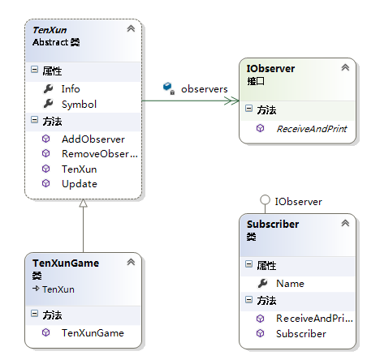
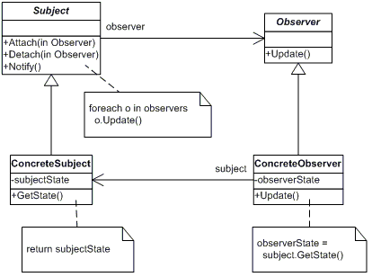

## 介绍
- 定义了一种一对多的依赖关系，让多个观察者对象同时监听某一个主题对象
- 这个主题对象在状态发生变化时，会通知所有观察者对象，使它们能够自动更新自己的行为。

- 观察者模式中首先会存在两个对象，一个是观察者对象，另一个就是主题对象
- 然而，根据面向接口编程的原则，则自然就有抽象主题角色和抽象观察者角色。

- 要想主题对象状态发生改变时，能通知到所有观察者角色，则自然主题角色必须所有观察者的引用
    - 这样才能在自己状态改变时，通知到所有观察者。

- 在下面的情况下可以考虑使用观察者模式：
    1. 当一个抽象模型有两个方面，其中一个方面依赖于另一个方面，将这两者封装在独立的对象中以使它们可以各自独立地改变和复用的情况下。
        - 从方面的这个词中可以想到，观察者模式肯定在AOP（面向方面编程）中有所体现
        - 更多内容参考：[Observern Pattern in AOP](http://www.cnblogs.com/idior/articles/229590.html).
    2. 当对一个对象的改变需要同时改变其他对象，而又不知道具体有多少对象有待改变的情况下。
    3. 当一个对象必须通知其他对象，而又不能假定其他对象是谁的情况下。


## 手写实现

### 初始实现
1. 游戏订阅号类
2. 是订阅者类
    - 订阅号类中必须引用一个订阅者对象，这样才能在订阅号状态改变时，调用这个订阅者对象的方法来通知到订阅者对象

- 但是 `TenxunGame` 类和 `Subscriber` 类之间形成了一种双向依赖关系
    - `TenxunGame` 调用了 `Subscriber` 的 `Receive_And_PrintData` 方法，
    - `Subscriber` 调用了 `TenxunGame` 类的属性。
- 这样的实现，如果有其中一个类变化将引起另一个类的改变。
    - 当出现一个新的订阅者时，此时不得不修改 `TenxunGame` 代码
    - 即添加另一个订阅者的引用和在Update方法中调用另一个订阅者的方法。
- 违背了“开放——封闭”原则

```cs
void Invoke_default()
{
    // 实例化订阅者和订阅号对象
    Subscriber LearningHardSub = new Subscriber("LearningHard");
    TenxunGame txGame = new TenxunGame();

    txGame.Subscriber = LearningHardSub;
    txGame.Symbol = "TenXun Game";
    txGame.Info = "Have a new game published ....";

    txGame.Update();

    Console.ReadLine();
}

// 游戏订阅号类
public class TenxunGame
{
    // 订阅者对象
    public Subscriber Subscriber { get; set; }

    public String Symbol { get; set; }

    public string Info { get; set; }

    // 更新函数
    public void Update()
    {
        // 如果有订阅人
        if (Subscriber != null)
        {
            // 调用订阅者对象来通知订阅者
            Subscriber.Receive_And_PrintData(this);
        }
    }

}

// 订阅者类
public class Subscriber
{
    public string Name { get; set; }
    public Subscriber(string name)
    {
        this.Name = name;
    }

    // 收到更新通知的处理函数
    public void Receive_And_PrintData(TenxunGame txGame)
    {
        Console.WriteLine("Notified {0} of {1}'s" + " Info is: {2}", Name, txGame.Symbol, txGame.Info);
    }
}
```

### 抽象与重构
- 对此我们要做进一步的抽象：
    - 既然这里变化的部分是新订阅者的出现
    - 可以对订阅者抽象出一个接口
        - 用它来取消 TenxunGame 类与具体的订阅者之间的依赖
    - 做这样一步改进，确实可以解决 TenxunGame 类与具体订阅者之间的依赖，使其依赖与接口，从而形成弱引用关系
    - 但还是不能解决出现一个订阅者不得不修改 TenxunGame 代码的问题。
- 对此，我们可以做这样的思考：
    - 订阅号存在多个订阅者，我们可以采用一个列表来保存所有的订阅者对象，在订阅号内部再添加对该列表的操作
    - 这样就解决了出现新订阅者的问题
    - 并且订阅号也属于变化的部分，所以，我们可以采用相同的方式对订阅号进行抽象，抽象出一个抽象的订阅号类



```cs
void Invoke_Observer()
{
    Observer_TenXun_Abstract observer = new TenXunGame("Observer_TenXun_Abstract Game", "Have a new game published ....");

    // 添加订阅者
    observer.AddSubscriber(new Subscriber("Learning Hard"));
    observer.AddSubscriber(new Subscriber("Tom"));

    observer.Update();

    Console.ReadLine();
}

// 订阅号抽象类
public abstract class Observer_TenXun_Abstract
{
    // 保存订阅者列表
    private List<ISubscriber> observers = new List<ISubscriber>();

    public string Symbol { get; set; }
    public string Info { get; set; }
    public Observer_TenXun_Abstract(string symbol, string info)
    {
        this.Symbol = symbol;
        this.Info = info;
    }

    #region 新增对订阅号列表的维护操作
    public void AddSubscriber(ISubscriber ob)
    {
        observers.Add(ob);
    }
    public void RemoveSubscriber(ISubscriber ob)
    {
        observers.Remove(ob);
    }
    #endregion

    public void Update()
    {
        // 遍历订阅者列表进行通知
        foreach (ISubscriber ob in observers)
        {
            if (ob != null)
            {
                ob.ReceiveAndPrint(this);
            }
        }
    }
}

// 具体订阅号类
public class TenXunGame : Observer_TenXun_Abstract
{
    public TenXunGame(string symbol, string info)
        : base(symbol, info) { }
}

// 订阅者接口
public interface ISubscriber
{
    void ReceiveAndPrint(Observer_TenXun_Abstract tenxun);
}

// 具体的订阅者类
public class Subscriber : ISubscriber
{
    public string Name { get; set; }
    public Subscriber(string name)
    {
        this.Name = name;
    }

    public void ReceiveAndPrint(Observer_TenXun_Abstract tenxun)
    {
        Console.WriteLine("Notified {0} of {1}'s" + " Info is: {2}", Name, tenxun.Symbol, tenxun.Info);
    }
}
```

## 借用委托-事件机制
```cs
void Invoke_Delegate(string[] args)
{
    TenXun tenXun = new TenXunGame("TenXun Game", "Have a new game published ....");
    Subscriber lh = new Subscriber("Learning Hard");
    Subscriber tom = new Subscriber("Tom");

    // 添加订阅者
    // 对委托链添加新的函数
    tenXun.AddObserver(new NotifyEventHandler(lh.ReceiveAndPrint));
    tenXun.AddObserver(new NotifyEventHandler(tom.ReceiveAndPrint));

    // 触发函数
    tenXun.Update();

    Console.WriteLine("-----------------------------------");
    Console.WriteLine("移除Tom订阅者");
    tenXun.RemoveObserver(new NotifyEventHandler(tom.ReceiveAndPrint));
    tenXun.Update();

    Console.ReadLine();
}

// 委托充当订阅者接口类
// 传入值为订阅号类的实例
public delegate void NotifyEventHandler(object sender);

// 抽象订阅号类
public class TenXun
{
    // 内部维护
    public NotifyEventHandler NotifyEvent;

    public string Symbol { get; set; }
    public string Info { get; set; }
    public TenXun(string symbol, string info)
    {
        this.Symbol = symbol;
        this.Info = info;
    }

    #region 新增对订阅号列表的维护操作
    // 向委托列表中追加一个新的委托
    // 实际就是添加了一个新的函数
    public void AddObserver(NotifyEventHandler ob)
    {
        NotifyEvent += ob;
    }
    // 从现有委托列表中去除相应委托
    public void RemoveObserver(NotifyEventHandler ob)
    {
        NotifyEvent -= ob;
    }
    #endregion

    public void Update()
    {   // 存在订阅者时，向委托列表传入自己作为参数
        if (NotifyEvent != null)
        {
            NotifyEvent(this);
        }
    }
}

// 具体订阅号类
public class TenXunGame : TenXun
{
    public TenXunGame(string symbol, string info)
        : base(symbol, info)
    {
    }
}

// 无需单独抽象一个抽象订阅者类

// 具体订阅者类
public class Subscriber
{
    public string Name { get; set; }
    public Subscriber(string name)
    {
        this.Name = name;
    }

    public void ReceiveAndPrint(Object obj)
    {
        // 将传入的 obj 尝试转换为 TenXun 类
        TenXun tenxun = obj as TenXun;
        // 转换成功则执行
        if (tenxun != null)
        {
            Console.WriteLine("Notified {0} of {1}'s" + " Info is: {2}", Name, tenxun.Symbol, tenxun.Info);
        }
    }
}
```


## 总结



1. **抽象主题角色**（Subject）：
    - 抽象主题把所有观察者对象的引用保存在一个列表中，并提供增加和删除观察者对象的操作
    - 又叫做抽象被观察者角色，一般由抽象类或接口实现。
2. **抽象观察者角色**（Observer）：
    - 为所有具体观察者定义一个接口，在得到主题通知时更新自己
    - 一般由抽象类或接口实现。
3. **具体主题角色**（ConcreteSubject）：
    -   实现抽象主题接口
    - 又叫做具体被观察者角色。
4. **具体观察者角色**（ConcreteObserver）：
    - 实现抽象观察者角色所要求的接口，以便使自身状态与主题的状态相协调。

- 优点：
    1. 观察者模式实现了表示层和数据逻辑层的分离，并定义了稳定的更新消息传递机制，并抽象了更新接口，使得可以有各种各样不同的表示层，即观察者。
    2. 观察者模式在被观察者和观察者之间建立了一个抽象的耦合，被观察者并不知道任何一个具体的观察者，只是保存着抽象观察者的列表，每个具体观察者都符合一个抽象观察者的接口。
    3. 观察者模式支持广播通信。被观察者会向所有的注册过的观察者发出通知。

- 缺点：
    1. 如果一个被观察者有很多直接和间接的观察者时，将所有的观察者都通知到会花费很多时间。
    2. 虽然观察者模式可以随时使观察者知道所观察的对象发送了变化，但是观察者模式没有相应的机制使观察者知道所观察的对象是怎样发生变化的。
    3. 如果在被观察者之间有循环依赖的话，被观察者会触发它们之间进行循环调用，导致系统崩溃，在使用观察者模式应特别注意这点。


## 参考资料
- [博客园: C#设计模式(17)——观察者模式（Observer Pattern）](https://www.cnblogs.com/zhili/p/ObserverPattern.html)
- [【设计模式】CSharp实现行为型模式之-观察者模式](https://www.lincol29.cn/observepattern)
