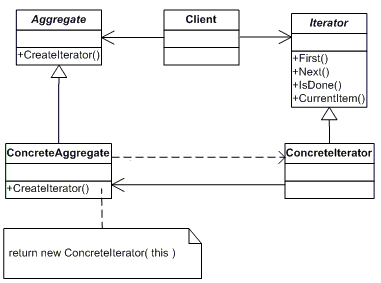

## 介绍
- 提供了一种方法顺序访问一个聚合对象（理解为集合对象）中各个元素，而又无需暴露该对象的内部表示
- 这样既可以做到不暴露集合的内部结构，又可让外部代码透明地访问集合内部的数据。

- 使用场景
    - 系统需要访问一个聚合对象的内容而无需暴露它的内部表示。
    - 系统需要支持对聚合对象的多种遍历。
    - 系统需要为不同的聚合结构提供一个统一的接口。

## 例子
```cs
void Invoke_Interator()
{
    // 声明一个聚合类
    IListCollection list = new ConcreteList();
    // 声明一个迭代器
    Iterator iterator = list.GetIterator();
    // 使用迭代器遍历
    while (iterator.MoveNext())
    {
        int i = (int)iterator.GetCurrent();
        Console.WriteLine(i.ToString());
        iterator.Next();
    }

    Console.Read();
}

#region 抽象类

// 抽象聚合类
public interface IListCollection
{
    Iterator GetIterator();
}

// 迭代器抽象类
public interface Iterator
{
    bool MoveNext();

    Object GetCurrent();

    void Next();

    void Reset();
}

#endregion 抽象类

#region 具体类

// 具体聚合类
public class ConcreteList : IListCollection
{
    private int[] collection;

    public ConcreteList()
    {
        collection = new int[] { 2, 4, 6, 8 };
    }

    public Iterator GetIterator()
    {
        return new ConcreteIterator(this);
    }

    public int Length
    {
        get { return collection.Length; }
    }

    public int GetElement(int index)
    {
        return collection[index];
    }
}

// 具体迭代器类
public class ConcreteIterator : Iterator
{
    // 迭代器要集合对象进行遍历操作，自然就需要引用集合对象
    private ConcreteList _list;

    private int _index;

    public ConcreteIterator(ConcreteList list)
    {
        _list = list;
        _index = 0;
    }

    public bool MoveNext()
    {
        if (_index < _list.Length)
        {
            return true;
        }
        return false;
    }

    public Object GetCurrent()
    {
        return _list.GetElement(_index);
    }

    public void Reset()
    {
        _index = 0;
    }

    public void Next()
    {
        if (_index < _list.Length)
        {
            _index++;
        }
    }
}

#endregion 具体类
```


## .NET 中的迭代器
- 在.NET下，迭代器模式中的聚集接口和迭代器接口都已经存在了
    - 其中 `IEnumerator` 接口扮演的就是迭代器角色
    - `IEnumberable` 接口则扮演的就是抽象聚集的角色
        - 只有一个 `GetEnumerator()` 方法
- 在 .NET 1.0 中，.NET 类库中很多集合都已经实现了迭代器模式
- 在.NET 2.0中，由于有了 `yield return` 关键字，实现迭代器模式就更简单了
    - [[C#基础知识系列]专题十二:迭代器](https://www.cnblogs.com/zhili/archive/2012/12/02/Interator.html)


## 总结



1. 迭代器角色（`Iterator`）：
    - 迭代器角色负责定义访问和遍历元素的接口
2. 具体迭代器角色（`ConcreteIteraror`）：
    - 具体迭代器角色实现了迭代器接口，并需要记录遍历中的当前位置。
3. 聚合角色（`Aggregate`）：
    - 聚合角色负责定义获得迭代器角色的接口
4. 具体聚合角色（`ConcreteAggregate`）：
    - 具体聚合角色实现聚合角色接口。

- 优点：
    1. 迭代器模式使得访问一个聚合对象的内容而无需暴露它的内部表示，即迭代抽象。
    2. 迭代器模式为遍历不同的集合结构提供了一个统一的接口，从而支持同样的算法在不同的集合结构上进行操作
- 缺点
    - 迭代器模式在遍历的同时更改迭代器所在的集合结构会导致出现异常。
        - 所以使用 `foreach` 语句只能在对集合进行遍历，不能在遍历的同时更改集合中的元素。
