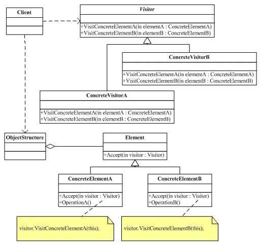

## 介绍
- 访问者模式是封装一些施加于某种数据结构之上的操作。
- 一旦这些操作需要修改的话，接受这个操作的数据结构则可以保存不变。
- 访问者模式适用于数据结构相对稳定的系统
    - 它把数据结构和作用于数据结构之上的操作之间的耦合度降低
    - 使得操作集合可以相对自由地改变。

- 数据结构的每一个节点都可以接受一个访问者的调用
    - 此节点向访问者对象传入节点对象
    - 而访问者对象则反过来执行节点对象的操作
- 这样的过程叫做“双重分派”。
    - 节点调用访问者，将它自己传入
    - 访问者则将某算法针对此节点执行。


##
```cs
void Invoke_Example()
{
    // 药品
    Medicine a = new MedicineA("板蓝根", 11.0);
    Medicine b = new MedicineB("感康", 14.3);

    // 处方单
    Prescription presciption = new Prescription();
    presciption.AddMedicine(a);
    presciption.AddMedicine(b);

    // 医生
    Visitor doctor = new Doctor("张三");
    // 药房拿药者
    Visitor workerOfPharmacy = new WorkerOfPharmacy("李四");

    // 开始业务流程
    // 1. 调用 Element.Accept(vistor)
    // 2. 在 Accept 函数中调用 vistor.Visit(this)
    // 3. 在 Visit 函数中对 vistor 做业务处理
    presciption.Accept(doctor);
    Console.WriteLine("------------------------------");
    presciption.Accept(workerOfPharmacy);

    Console.ReadLine();
}
/* 输出：
 * 医生：张三，开药：板蓝根，价格：11
 * 医生：张三，开药：感康，价格：14.3
 * ------------------------------
 * 药房工作者：张三，拿药：板蓝根，价格：11
 * 药房工作者：张三，拿药：感康，价格：14.3
 */


// 对象结构：处方单
// 用于存放元素对象，并且提供了遍历其内部元素的方法。
public class Prescription
{
    private List<Medicine> list = new List<Medicine>();

    public void Accept(Visitor visitor)
    {
        for (int i = 0; i < list.Count; i++)
        {
            list[i].Accept(visitor);
        }
    }

    public void AddMedicine(Medicine medicine)
    {
        list.Add(medicine);
    }

    public void RemoveMedicien(Medicine medicine)
    {
        list.Remove(medicine);
    }
}

#region

// 抽象访问者
public abstract class Visitor
{
    public string Name { get; set; }

    public Visitor(string name)
    {
        Name = name;
    }

    public abstract void Visit(MedicineA a);

    public abstract void Visit(MedicineB b);
}

// 具体访问者：医生
public class Doctor : Visitor
{
    public Doctor(string name) :
        base(name)
    { }

    public override void Visit(MedicineA a)
        => Console.WriteLine("医生：" + this.Name + "，开药：" + a.Name + "，价格：" + a.Price);

    public override void Visit(MedicineB b)
        => Console.WriteLine("医生：" + this.Name + "，开药：" + b.Name + "，价格：" + b.Price);
}

// 具体访问者：药房工作者
public class WorkerOfPharmacy : Visitor
{
    public WorkerOfPharmacy(string name) :
        base(name)
    { }

    public override void Visit(MedicineA a)
        => Console.WriteLine("药房工作者：" + this.Name + "，拿药：" + a.Name);

    public override void Visit(MedicineB b)
        => Console.WriteLine("药房工作者：" + this.Name + "，拿药：" + b.Name);
}

#endregion

#region 元素

// 抽象元素：药品
public abstract class Medicine
{
    public string Name { get; set; }
    public double Price { get; set; }

    public Medicine(string name, double price)
    {
        this.Name = name;
        this.Price = price;
    }

    public abstract void Accept(Visitor visitor);
}

// 具体元素：药品A
public class MedicineA : Medicine
{
    public MedicineA(string name, double price) :
        base(name, price)
    { }

    public override void Accept(Visitor visitor) => visitor.Visit(this);
}

// 具体元素：药品B
public class MedicineB : Medicine
{
    public MedicineB(string name, double price) :
        base(name, price)
    { }

    public override void Accept(Visitor visitor) => visitor.Visit(this);
}

#endregion
```


## 总结



1. `Vistor`（抽象访问者）：
    - 抽象访问者为对象结构中每一个具体元素类 `ConcreteElement` 声明一个访问操作
    - 从这个操作的名称或参数类型可以清楚知道需要访问的具体元素的类型
    - 具体访问者需要实现这些操作方法，定义对这些元素的访问操作。

2. `ConcreteVisitor`（具体访问者）：
    - 具体访问者实现了每个由抽象访问者声明的操作
    - 每一个操作用于访问对象结构中一种类型的元素。

3. `Element`（抽象元素）：
    - 抽象元素一般是抽象类或者接口
    - 它定义一个 `Accept()` 方法，该方法通常以一个抽象访问者作为参数。

4. `ConcreteElement`（具体元素）：
    - 具体元素实现了 `Accept()` 方法
    - 在 `Accept()` 方法中调用访问者的访问方法以便完成对一个元素的操作。

5. `ObjectStructure`（对象结构）：
    - 对象结构是一个元素的集合，它用于存放元素对象，并且提供了遍历其内部元素的方法。
    - 它可以结合组合模式来实现，也可以是一个简单的集合对象
        - 如一个 `List` 对象或一个 `Set` 对象。


- 优点：
    1. 增加新的访问操作很方便
        - 使用访问者模式，增加新的访问操作就意味着增加一个新的具体访问者类，实现简单
        - 无须修改源代码，符合“开闭原则”
    2. 将有关元素对象的访问行为集中到一个访问者对象中，而不是分散在一个个的元素类中
        - 类的职责更加清晰，有利于对象结构中元素对象的复用，相同的对象结构可以供多个不同的访问者访问。
    3. 让用户能够在不修改现有元素类层次结构的情况下，定义作用于该层次结构的操作

- 缺点：
    1. 增加新的元素类很困难
        - 在访问者模式中，每增加一个新的元素类都意味着要在抽象访问者角色中增加一个新的抽象操作
        - 并在每一个具体访问者类中增加相应的具体操作，这违背了“开闭原则”的要求。
    2. 破坏封装
        - 访问者模式要求访问者对象访问并调用每一个元素对象的操作
        - 这意味着元素对象有时候必须暴露一些自己的内部操作和内部状态，否则无法供访问者访问。

>[!note]
> - 方便添加访问者，不方便添加新元素
> - 方便修改元素所在层次（也就是对象结构类）操作
