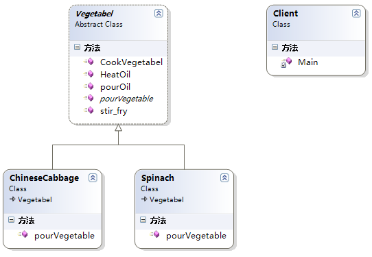

## 介绍
- 在一个抽象类中定义一个操作中的算法骨架（对应于生活中的大家下载的模板），而将一些步骤延迟到子类中去实现（对应于我们根据自己的情况向模板填充内容）。
- 模板方法使得子类可以不改变一个算法的结构前提下，重新定义算法的某些特定步骤
- 把不变行为搬到超类中，从而去除了子类中的重复代码。

- 把相同的部分抽象出来到抽象类中去定义，具体子类来实现具体的不同部分


## 例子


```cs
// 客户端调用
void Invoke_Template()
{
    // 创建一个菠菜实例并调用模板方法
    Spinach spinach = new Spinach();
    spinach.CookVegetabel();
    Console.Read();
}

// 抽象模板
public abstract class Vegetabel
{
    // 模板方法，不要把模版方法定义为Virtual或abstract方法，避免被子类重写，防止更改流程的执行顺序
    public void CookVegetabel()
    {
        Console.WriteLine("抄蔬菜的一般做法");
        this.pourOil();
        this.HeatOil();
        this.pourVegetable();
        this.stir_fry();
    }

    // 第一步倒油
    public void pourOil() => Console.WriteLine("倒油");

    // 把油烧热
    public void HeatOil() => Console.WriteLine("把油烧热");

    // 油热了之后倒蔬菜下去，具体哪种蔬菜由子类决定
    public abstract void pourVegetable();

    // 开发翻炒蔬菜
    public void stir_fry()
    {
        Console.WriteLine("翻炒");
    }
}

#region 具体类
// 菠菜
public class Spinach : Vegetabel
{

    public override void pourVegetable()
    {
        Console.WriteLine("倒菠菜进锅中");
    }
}

// 大白菜
public class ChineseCabbage : Vegetabel
{
    public override void pourVegetable()
    {
        Console.WriteLine("倒大白菜进锅中");
    }
}
#endregion
```


## 总结
1. 抽象模板角色（Vegetable扮演这个角色）：
    - 定义了一个或多个抽象操作，以便让子类实现，这些抽象操作称为基本操作。
2. 具体模板角色（ChineseCabbage和Spinach扮演这个角色）：
    - 实现父类所定义的一个或多个抽象方法。

- 优点：
    1. 实现了代码复用
    2. 能够灵活应对子步骤的变化，符合开放-封闭原则
- 缺点：
    1. 因为引入了一个抽象类，如果具体实现过多的话，需要用户或开发人员需要花更多的时间去理清类之间的关系。

- 在.NET中模板方法的应用也很多
    - 例如我们在开发自定义的Web控件或WinForm控件时，我们只需要重写某个控件的部分方法。

- 模板方法模式在抽象类中定义了算法的实现步骤，将这些步骤的实现延迟到具体子类中去实现，从而使所有子类复用了父类的代码
    - 所以模板方法模式是基于继承的一种实现代码复用的技术
