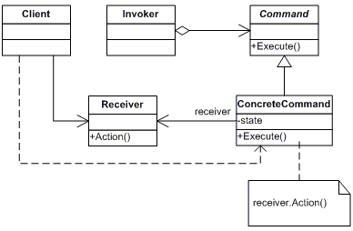

## 介绍
- 把一个操作或者行为抽象为一个对象中
- 通过对命令的抽象化来使得发出命令的责任和执行命令的责任分隔开
- 命令模式的实现可以提供命令的撤销和恢复功能。

- 在下面的情况下可以考虑使用命令模式：
    1. 系统需要支持命令的撤销（undo）。
        - 命令对象可以把状态存储起来，等到客户端需要撤销命令所产生的效果时，可以调用 undo 方法吧命令所产生的效果撤销掉。
        - 命令对象还可以提供 redo 方法，以供客户端在需要时，再重新实现命令效果。
    2. 系统需要在不同的时间指定请求、将请求排队。
        - 一个命令对象和原先的请求发出者可以有不同的生命周期。
        - 意思为：原来请求的发出者可能已经不存在了，而命令对象本身可能仍是活动的。
        - 这时命令的接受者可以在本地，也可以在网络的另一个地址。
        - 命令对象可以串行地传送到接受者上去。
    3. 如果一个系统要将系统中所有的数据消息更新到日志里，以便在系统崩溃时，可以根据日志里读回所有数据的更新命令，重新调用方法来一条一条地执行这些命令，从而恢复系统在崩溃前所做的数据更新。
    4. 系统需要使用命令模式作为 “CallBack(回调)” 在面向对象系统中的替代。
        - Callback即是先将一个方法注册上，然后再以后调用该方法。

## 例子
- 军训场景中
    1. 具体的命令即是学生跑1000米
    2. 学生是命令的接收者
    3. 教官是命令的请求者
    4. 院领导是命令的发出者，即客户端角色。
    5. 要实现命令模式，则必须需要一个抽象命令角色来声明约定，这里以抽象类来来表示。
    
- 命令的传达流程是：
    1. 命令的发出者必须知道具体的命令、接受者和传达命令的请求者，对应于程序也就是在客户端角色中需要实例化三个角色的实例对象了。
    2. 命令的请求者负责调用命令对象的方法来保证命令的执行，对应于程序也就是请求者对象需要有命令对象的成员，并在请求者对象的方法内执行命令。
    3. 具体命令就是跑1000米，这自然属于学生的责任，所以是具体命令角色的成员方法，而抽象命令类定义这个命令的抽象接口。

```cs
// 院领导 => 主程序

void Invoke_Command(string[] args)
{
    // 初始化Receiver、Invoke和Command
    Receiver r = new Receiver();
    Command c = new ConcreteCommand(r);
    CommandInvoker i = new CommandInvoker(c);

    // 院领导发出命令
    i.ExecuteCommand();
}


// 教官，负责调用命令对象执行请求
public class CommandInvoker
{
    public Command _command;

    public CommandInvoker(Command command)
    {
        this._command = command;
    }

    // 接收命令后执行
    public void ExecuteCommand() => _command.Action();
}

// 命令接收者——学生
public class Receiver
{
    public void Run1000Meters() => Console.WriteLine("跑1000米");
}

// 命令抽象类
public abstract class Command
{
    // 命令应该知道接收者是谁，所以有Receiver这个成员变量
    protected Receiver _receiver;

    public Command(Receiver receiver)
    {
        this._receiver = receiver;
    }

    // 命令执行方法
    public abstract void Action();
}

//具体指令
public class ConcreteCommand : Command
{
    public ConcreteCommand(Receiver receiver)
        : base(receiver)    { }

    // 调用接收的方法，因为执行命令的是学生
    public override void Action() =>_receiver.Run1000Meters();

}
```


## 总结


1. 客户角色：
    - 发出一个具体的命令并确定其接受者。
2. 命令角色：
    - 声明了一个给所有具体命令类实现的抽象接口
3. 具体命令角色：
    - 定义了一个接受者和行为的弱耦合，负责调用接受者的相应方法。
4. 请求者角色：
    - 负责调用命令对象执行命令。
5. 接受者角色：
    - 负责具体行为的执行。

- 优点：
    1. 命令模式使得新的命令很容易被加入到系统里。
    2. 可以设计一个命令队列来实现对请求的Undo和Redo操作。
    3. 可以较容易地将命令写入日志。
    4. 可以把命令对象聚合在一起，合成为合成命令。合成命令式合成模式的应用。
- 缺点：
    1. 使用命令模式可能会导致系统有过多的具体命令类。
        - 这会使得命令模式在这样的系统里变得不实际。
