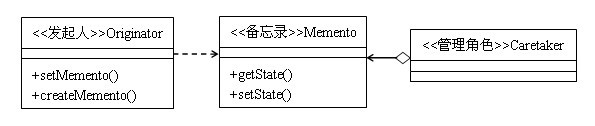

## 介绍
- 在不破坏封装的前提下，捕获一个对象的内部状态，并在该对象之外保存这个状态，这样以后就可以把该对象恢复到原先的状态。

- 在以下情况下可以考虑使用备忘录模式：
    1. 如果系统需要提供回滚操作时，使用备忘录模式非常合适。
        - 文本编辑器的Ctrl+Z撤销操作的实现
        - 数据库中事务操作。


## 例子

### 单还原点
```cs
void Invoke_Single_Memento(string[] args)
{
    List<ContactPerson> persons = new List<ContactPerson>()
    {
        new ContactPerson() { Name= "Learning Hard", MobileNum = "123445"},
        new ContactPerson() { Name = "Tony", MobileNum = "234565"},
        new ContactPerson() { Name = "Jock", MobileNum = "231455"}
    };
    MobileOwner mobileOwner = new MobileOwner(persons);
    mobileOwner.Show();

    // 创建备忘录并保存备忘录对象
    Memento_Manager caretaker = new Memento_Manager();
    caretaker.ContactM = mobileOwner.CreateMemento();

    // 更改发起人联系人列表
    Console.WriteLine("----移除最后一个联系人--------");
    mobileOwner.ContactPersons.RemoveAt(2);
    mobileOwner.Show();

    // 恢复到原始状态
    Console.WriteLine("-------恢复联系人列表------");
    mobileOwner.RestoreMemento(caretaker.ContactM);
    mobileOwner.Show();

    Console.Read();
}

// 联系人
public class ContactPerson
{
    public string Name { get; set; }
    public string MobileNum { get; set; }
}

// 发起人
public class MobileOwner
{
    // 发起人需要保存的内部状态
    public List<ContactPerson> ContactPersons { get; set; }

    public MobileOwner(List<ContactPerson> persons)
    {
        ContactPersons = persons;
    }

    // 创建备忘录，将当期要保存的联系人列表导入到备忘录中 
    public Memento_Contact CreateMemento()
    {
        // 这里实际应该传递深拷贝，new List方式传递的是浅拷贝
        //  - 但是因为ContactPerson类中都是string类型,
        //      所以这里new list方式对ContactPerson对象执行了深拷贝
        //  - 如果ContactPerson包括非string的引用类型就会有问题，
        //      所以这里也应该用序列化传递深拷贝
        return new Memento_Contact(new List<ContactPerson>(this.ContactPersons));
    }

    // 将备忘录中的数据备份导入到联系人列表中
    public void RestoreMemento(Memento_Contact memento)
    {
        // - 下面这种方式是错误的，因为这样传递的是引用
        //      - 则删除一次可以恢复，但恢复之后再删除的话就恢复不了.
        // - 所以应该传递contactPersonBack的深拷贝，深拷贝可以使用序列化来完成
        this.ContactPersons = memento.contactPersonBack;
    }

    public void Show()
    {
        Console.WriteLine("联系人列表中有{0}个人，他们是:", ContactPersons.Count);
        foreach (ContactPerson p in ContactPersons)
        {
            Console.WriteLine("姓名: {0} 号码为: {1}", p.Name, p.MobileNum);
        }
    }
}

// 备忘录
public class Memento_Contact
{
    // 保存发起人的内部状态
    public List<ContactPerson> contactPersonBack;

    public Memento_Contact(List<ContactPerson> persons)
    {
        contactPersonBack = persons;
    }
}

// 管理角色
public class Memento_Manager
{
    public Memento_Contact ContactM { get; set; }
}
```

### 多还原点
```cs
void Invoke_Multiple()
{
    List<ContactPerson> persons = new List<ContactPerson>()
    {
        new ContactPerson() { Name= "Learning Hard", MobileNum = "123445"},
        new ContactPerson() { Name = "Tony", MobileNum = "234565"},
        new ContactPerson() { Name = "Jock", MobileNum = "231455"}
    };

    MobileOwner mobileOwner = new MobileOwner(persons);
    mobileOwner.Show();

    // 创建备忘录并保存备忘录对象
    Memento_Manager caretaker = new Memento_Manager();
    caretaker.ContactMementoDic.Add(DateTime.Now.ToString(), mobileOwner.CreateMemento());

    // 更改发起人联系人列表
    Console.WriteLine("----移除最后一个联系人--------");
    mobileOwner.ContactPersons.RemoveAt(2);
    mobileOwner.Show();

    // 创建第二个备份
    Thread.Sleep(1000);
    caretaker.ContactMementoDic.Add(DateTime.Now.ToString(), mobileOwner.CreateMemento());

    // 恢复到原始状态
    Console.WriteLine("-------恢复联系人列表,请从以下列表选择恢复的日期------");
    var keyCollection = caretaker.ContactMementoDic.Keys;
    foreach (string k in keyCollection)
    {
        Console.WriteLine("Key = {0}", k);
    }
    while (true)
    {
        Console.Write("请输入数字,按窗口的关闭键退出:");

        int index = -1;
        try
        {
            index = Int32.Parse(Console.ReadLine());
        }
        catch
        {
            Console.WriteLine("输入的格式错误");
            continue;
        }

        Memento_Contact contactMentor = null;
        if (index < keyCollection.Count && caretaker.ContactMementoDic.TryGetValue(keyCollection.ElementAt(index), out contactMentor))
        {
            mobileOwner.RestoreMemento(contactMentor);
            mobileOwner.Show();
        }
        else
        {
            Console.WriteLine("输入的索引大于集合长度！");
        }
    }
}

// 联系人
public class ContactPerson
{
    public string Name { get; set; }
    public string MobileNum { get; set; }
}

// 发起人
public class MobileOwner
{
    public List<ContactPerson> ContactPersons { get; set; }
    public MobileOwner(List<ContactPerson> persons)
    {
        ContactPersons = persons;
    }

    // 创建备忘录，将当期要保存的联系人列表导入到备忘录中 
    public Memento_Contact CreateMemento()
    {
        // 这里应该传递深拷贝
        return new Memento_Contact(new List<ContactPerson>(this.ContactPersons));
    }

    // 将备忘录中的数据备份导入到联系人列表中
    public void RestoreMemento(Memento_Contact memento)
    {
        if (memento != null)
        {
            // 应该传递的深拷贝
            this.ContactPersons = memento.ContactPersonBack;
        }
    }
    public void Show()
    {
        Console.WriteLine("联系人列表中有{0}个人，他们是:", ContactPersons.Count);
        foreach (ContactPerson p in ContactPersons)
        {
            Console.WriteLine("姓名: {0} 号码为: {1}", p.Name, p.MobileNum);
        }
    }
}

// 备忘录
public class Memento_Contact
{
    public List<ContactPerson> ContactPersonBack { get; set; }
    public Memento_Contact(List<ContactPerson> persons)
    {
        ContactPersonBack = persons;
    }
}

// 管理角色
public class Memento_Manager
{
    // 使用多个备忘录来存储多个备份点
    public Dictionary<string, Memento_Contact> ContactMementoDic { get; set; }
    public Memento_Manager()
    {
        ContactMementoDic = new Dictionary<string, Memento_Contact>();
    }
}
```


## 总结


1. 发起人角色：
    - 记录当前时刻的内部状态，负责创建和恢复备忘录数据。
2. 备忘录角色：
    - 负责存储发起人对象的内部状态，在进行恢复时提供给发起人需要的状态。
3. 管理者角色：
    - 负责保存备忘录对象。

- 优点：
    1. 如果某个操作错误地破坏了数据的完整性，此时可以使用备忘录模式将数据恢复成原来正确的数据。
    2. 备份的状态数据保存在发起人角色之外，这样发起人就不需要对各个备份的状态进行管理。而是由备忘录角色进行管理，而备忘录角色又是由管理者角色管理，符合单一职责原则。
- 缺点：
    1. 在实际的系统中，可能需要维护多个备份，需要额外的资源，这样对资源的消耗比较严重。
