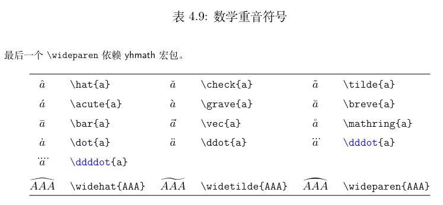

# LaTex 笔记
> [!note|label:插件支持]
> [KaTeX文档](https://github.com/KaTeX/KaTeX)  
> [docsify-latex插件](https://scruel.github.io/docsify-latex/#/?id=usage)  
 
# 基础引入

## KaTex语法
通过Markdown按照下面的语法：
```math
x=\frac{-b\pm\sqrt{b^2-4ac}}{2a}
```

就自动渲染出数学公式：
 
$$  
 f(x)=\dfrac{1}{2}  
$$  
 
如果要内嵌KaTeX公式，可以用这样的Markdown语法：  
内嵌的Katex效果 $E=mc^2$ 就是这样
```latex
    内嵌的Katex效果 $E=mc^2$ 就是这样
```

# 表格（本站不支持）
## 普通表格
```tex
\begin{table}[h]  % [h]表格在文中放置的位置
    \centering  %作用是使表格居中
    \begin{spacing}{1.35}  %调整表格行距
    \caption{National vulnerability classification} %表格标题
    \label{table5} %表格标签 方便引用
    \resizebox{0.5\hsize}{!}{  % 缩小整体表格 需要导包
        \begin{tabular}{|c|c|}   % c 表示表格中的文字居中
        \hline
        \textbf{index} & \textbf{ Class} \\  %\texbf 表示加粗
        \hline
        0 &     Steady \\
        \hline
        1 &     Fragile \\
        \hline
        2 & Very fragile \\
        \hline
        \end{tabular}
    }
    \end{spacing}
\end{table}
```

## 三线表
```tex
\begin{center}
    \begin{spacing}{1.1}
        % longtable: 表格可跨页
        \begin{longtable}
            {p{.1\textwidth}p{.7\textwidth}m{.3\textwidth}}
            \caption{description}
                \label{table1}
            %第一行线
            \toprule
                % 表示第一列占1.5cm 第二列占6cm 第三列占2cm 的距离
                % 并且这几个字都是居中对齐
                \multicolumn{1}{m{1.5cm}}{\centering Symbol} 
                    & \multicolumn{1}{m{6cm}}{\centering Definition} 
                    & \multicolumn{1}{m{2cm}}{ Unit}        \\
            %第二行线
            \midrule
                $V$ & index & -- \\
                $X$ & The   & -- \\
                $Y$ & The   & -- \\
                $Z$ & The   & -- \\
            %第三行线
            \bottomrule
        \end{longtable}
    \end{spacing}
\end{center}
```

# 4. 排版数学公式

## 4.1 AMS宏集
导言区应引入\usepackage{amsmath}

## 4.2 公式排版基础

### 4.2.1行内公式与行间公式
数学公式有两种排版方式：其一是与文字混排，称为行内公式；其二是单独列为一行排版，称为行间公式。

#### 行内公式
行内公式通常使用`$..$`来输入，这通常被称为公式环境，例如：  
若$a>0$, $b>0$, 则$a+b>0$.
```tex
若$a>0$, $b>0$, 则$a+b>0$.
```

公式环境通常使用特殊的字体，并且默认为斜体。需要注意的是，只要是公式，就需要放入公式环境中。如果需要在行内公式中展现出行间公式的效果，可以在前面加入```\displaystyle```，例如
设$\displaystyle\lim_{n\to\infty}x_n=x$.
```tex
设$\displaystyle\lim_{n\to\infty}x_n=x$.
```
#### 行间公式
由「quation」环境包裹的，其为公式自动加上编号，可以用`\label`和`\ref`生成交叉引用；使用`\eqref`会为引用自动加上圆括号；可以用`\tag`命令手动修改公式编号，或用`\notag`取消为公式编号（有`\nonumber`基本等效）。

$$
    定理 \qquad
        \begin{equation}
            a^2 + b^2 = c^2 \qquad \label{pythagorean}
        \end{equation} \\
    定理 \eqref{pythagorean} 在中文中称为‘勾股定理’。 
$$
```tex
$$
    定理\\
        \begin{equation}
            a^2 + b^2 = c^2 \qquad \label{pythagorean}
        \end{equation} 
    定理 \eqref{pythagorean} 在中文中称为‘勾股定理’。 
$$
```
$$
    以下说法错误：\\
        \begin{equation}
            1+ 1=3  \quad\tag{dumb}
        \end{equation} \\

        \begin{equation}
            1+ 1=4  \notag
        \end{equation}
$$
```tex
$$
    以下说法错误：\\
        \begin{equation}
            1+ 1=3  \quad\tag{dumb}
        \end{equation} \\   or  \\
        \begin{equation}
            1+ 1=4  \notag
        \end{equation}
$$
```

### 4.2.2 数学模式
使用`$`开启行内公式输入，或者使用`\[`、`equation`环境时，$\LaTeX$就进入数学模式，相较文本模式有以下特点：  
1. **数学模式中输入空格被忽略**。  
    $\LaTeX$公式中数学符号的间距默认由符号的性质（关系符号、运算符等）决定。
    人为引入间距时，使用`\quad`和`\qquad`等命令。详见`4.6节`。
2. **不允许有空行（分段）**。  
    行间公式中无法使用`\\`手动换行，排版多行公式需要用到`4.4节`介绍各种环境。
3. **所有的字母被当作数学公式中的变量处理**。  
    字母间距与文本模式不一致，也无法生成单词之间的空格。  
    如果想在数学公式中输入正体的文本，简单情况下可用`4.7.1小节`中提供的`\mathrm` 命令。或者用 「amsmath」提供的 `\text` 命令2。

## 4.3 数学符号

### 4.3.1 一般符号
1. 希腊字母符号名称使用其英文名称，如 $\alpha$（`\alpha`）等。
2. 大写希腊字母为首字母大写命令，如 $\Gamma$（`\Gamma`）等。
3. 无穷大符号为 $\infty$（`\infty`）。
4. 省略号有 $\dots$（`\dots`）和 $\cdots$（`\cdots`）两种形式，分别用作下省略号和横省略号。  
    实际有`\ldots`与`\dots`完全等效，既可以用在公式也可以用在文本做省略号。  
    除此之外还有 $\vdots$（`\vdots`）和 $\ddots$（`\ddots`）作为矩阵中的省略号。

### 4.3.2 指数、上下标和导数
在 $\LaTeX$ 中用`^`和`_`注明上下标。上下标的子公式一般**用花括号 { } 包裹**，否则只对后面**第一个符号**起作用。  
$$ 
    p^3_{ij}                \qquad
    m_\mathrm{Knuth}        \qquad
    \sum_{k=1}^3 k          \\[5pt]
    a^x+y   \neq a^{x+y}    \qquad
    e^{x^2} \neq {e^x}^2
$$
```tex
$$ 
    p^3_{ij}                \qquad
    m_\mathrm{Knuth}        \qquad
    \sum_{k=1}^3 k          \\[5pt]
    a^x+y   \neq a^{x+y}    \qquad
    e^{x^2} \neq {e^x}^2
$$
```
导数符号'(`'`)是一类特殊的上标，可以适当连用表示多阶导数，也可以在其后连用上标。
$$
    f(x) = x^2  \quad
    f'(x)= 2x   \quad
    f''^{2}(x) = 4
$$
```tex
$$
    f(x) = x^2  \quad
    f'(x)= 2x   \quad
    f''^{2}(x) = 4
$$
```
### 4.3.3 分式和根式
#### 1. 一般分式
分式使用 `\frac{分子}{分母}` 来书写。其大小在行间公式内正常，在行内公式被极度压缩。  
「amsmath」提供命令 `\dfrac` 和 `\tfrac`，令用户在行内使用正常大小分式，或者反过来。
- 在行间公式（text style）：
    $$
        1\frac{1}{2}    hours  \qquad
        1\dfrac{1}{2}   hours
    $$
    ```tex
    $$
        1\frac{1}{2}    hours  \qquad
        1\dfrac{1}{2}   hours
    $$
    ```
- 在行内公式（display style）：  
    $  3/8    \qquad  \frac{3}{8} \qquad  \tfrac{3}{8}  $
    ```tex
    $  3/8    \qquad  \frac{3}{8} \qquad  \tfrac{3}{8}  $
    ```
#### 2. 一般根式
一般的根式使用 `\sqrt{...}` ；表示n次方根时写成 `\sqrt[n]{...}` 。
$$
    \sqrt{x}  \Leftrightarrow x^{1/2}   \quad
    \sqrt[3]{2}                         \quad
    \sqrt{x^{2}+\sqrt{y}}
    $$
```tex
$$
    \sqrt{x}  \Leftrightarrow x^{1/2}   \quad
    \sqrt[3]{2}                         \quad
    \sqrt{x^{2}+\sqrt{y}}
$$
```
#### 3. 特殊分式
特殊的分式形式，如二项式结构，由「amsmath」宏包的 `\binom` 命令生成。
$$
    \binom{n}{k}    =   \binom{n-1}{k}  +   \binom{n-1}{k-1}
$$
```tex
$$
    \binom{n}{k}    =   \binom{n-1}{k}  +   \binom{n-1}{k-1}
$$
```

### 4.3.4 关系
$\LaTeX$ 中常见关系符有：
- **可以直接输入的：**  
    $ = \, < \, > $  
    `$ = \, < \, > $`
- **需要命令的：**  
    约等号 $\approx$（`\approx`）、不等号 $\ne$（`\ne`）、
    小于等于号 $\le$（`\le`）、大于等于号 $\ge$（`\ge`）、
    等价 $\equiv$（`\equiv`）、正比 $\propto$（`\propto`）、
    相似 $\sim$（`\sim`）等等。
- **自定义二元关系符号：**  
    命令 `\stackrel`，用于将一个符号叠加在原有二元关系符上。  
    $ f_n(x) \stackrel{*}{\approx}  1 $  
    `$ f_n(x) \stackrel{*}{\approx}  1 $`

### 4.3.5 算符
#### 1. 常用算符
$\LaTeX$ 中的算符大多都是二元算符，除了可以直接用键盘输入的 
    $ + \, - \, * \, / $之外，
其他符号用命令输入，常用的有：  
    乘号 $\times$（`\times`）、除号 $\div$（`\div`）、
    点乘 $\cdot$(`\cdot`)、加减号 $\pm$(`\pm`) / $\mp$(`\mp`)
等等。

$\nabla$(`\nabla`)和 $\partial$(`\partial`)也是常用的算符，虽然它们不属于二元算符。

#### 2. 函数算符
$\LaTeX$ 将数学函数的名称作为一个算符排版，字体为直立字体。其中有一部分符号在上下位
置可以书写一些内容作为条件，类似于后文所叙述的巨算符。
> [!note|label:表4-1 LATEX 作为算符的函数名称一览]  
> - 不带上下限的算符：  
    ```tex
    \sin、  \cos、  \tan、  \cot、  \sec  
    \arcsin、\arccos、\arctan、\arg、\csc  
    \sinh、 \cosh、 \tanh、 \coth  
    \exp、  \log、  \lg、   \ln  
    \dim、  \ker、  \hom、  \deg  
    ```
> - 带上下限的算符
    ```tex
    \lim  \limsup  \liminf  \sup  \inf  
    \min  \max  \det  \Pr  \gcd
    ```
    例如 `\lim_{下标}{公式}`：  
    $$  \lim_{x \rightarrow 0}\frac{\sin x}{x}  =   1  $$
    `$$  \lim_{x \rightarrow 0}\frac{\sin x}{x}  =   1  $$`
    
对于求模表达式，$\LaTeX$ 提供了 `\bmod` 和 `\pmod` 命令，前者相当于一个二元运算符，后者
作为同余表达式的后缀：
    $$
        a \bmod  b \\
        x \equiv a \pmod{b}
    $$
    ```tex
    $$
        a \bmod  b \\
        x \equiv a \pmod{b}
    $$
    ```
#### 3. 自定义算符（本站未支持）
如果算符不够用的话，「amsmath」允许用户在导言区用 `\DeclareMathOperator`
定义自己的算符，其中带星号的命令定义带上下限的算符：
```tex
    \DeclareMathOperator{\argh}{argh}
    \DeclareMathOperator*{\nut}{Nut}
```
例如： $ \argh 3 = \nut_{x=1} 4x $
```tex
    $ \argh 3 = \nut_{x=1} 4x $
```

### 4.3.6 巨算符
积分号 $\int$(\int)、求和号 $\sum$(\sum) 等符号称为**巨算符**。
#### 1. 巨算符在行内与行间的区别
巨算符在行内公式和行间公式的大小和形状有区别。
- 行内公式（text）:  
    $ \sum_{i=1}^n  \quad   \int_0^{\frac{\pi}{2}} $  
    $ \oint_0^{\frac{\pi}{2}} \quad \prod_\epsilon $
    ```tex
        $ \sum_{i=1}^n  \quad   \int_0^{\frac{\pi}{2}} $  
        $ \oint_0^{\frac{\pi}{2}} \quad \prod_\epsilon $
    ```
- 行间公式（display）:
    $$
    \sum_{i=1}^n            \quad
    \int_0^{\frac{\pi}{2}}  \quad
    \oint_0^{\frac{\pi}{2}} \quad
    \prod_\epsilon 
    $$
    ```tex
    $$
        \sum_{i=1}^n            \quad
        \int_0^{\frac{\pi}{2}}  \quad
        \oint_0^{\frac{\pi}{2}} \quad
        \prod_\epsilon 
    $$
    ```
#### 2. 上下标位置调整
巨算符的上下标位置可由 `\limits` 和 `\nolimits` 调整：
- 前者令巨算符类似 $\lim$ 或求和算符 $\sum$ ，上下标位于上下方；
- 后者令巨算符类似积分号，上下标位于右上方和右下方。

例如有
- 行内模式（text）:  
    $ \sum  \limits_{i=1}^n   \quad         $
    $ \int  \limits_0^{\frac{\pi}{2}}  \quad$
    $ \prod \limits_    \epsilon            $
    ```tex
        $ \sum  \limits_{i=1}^n   \quad         $
        $ \int  \limits_0^{\frac{\pi}{2}}  \quad$
        $ \prod \limits_    \epsilon            $
    ```
- 行间模式（display）:  
    $$
    \sum    \nolimits_{i=1}^n           \quad
    \int    \limits_0^{\frac{\pi}{2}}   \quad
    \prod   \nolimits_  \epsilon
    $$
    ```tex
    $$
        \sum    \nolimits_{i=1}^n           \quad
        \int    \limits_0^{\frac{\pi}{2}}   \quad
        \prod   \nolimits_  \epsilon
    $$
    ```
#### 3. 自定义巨算符
「amsmath」宏包还提供了 `\substack`，能够在下限位置书写多行表达式；
`subarray`环境更进一步，令多行表达式可选择居中(c)或左对齐(l)：  
$$
    \sum_{
        \substack{
            0  \le  i  \le  n    \\
            j  \in  \mathbb{R}
        }
    }P(i,j)=Q(n)                \\
    \sum_{
        \begin{subarray}{l}
            0  \le  i  \le  n    \\
            j  \in  \mathbb{R}
        \end{subarray}
    }P(i,j)=Q(n)
$$
```tex
$$
    \sum_{
        \substack{
            0  \le  i  \le  n    \\
            j  \in  \mathbb{R}
        }
    }P(i,j)=Q(n)                \\
    \sum_{
        \begin{subarray}{l}
            0  \le  i  \le  n    \\
            j  \in  \mathbb{R}
        \end{subarray}
    }P(i,j)=Q(n)
$$
```

## 4.9 符号表

### 4.9.1 LaTex普通符号

> [!note|label:表4-4 文本-数学模式通用符号]
> 这些符号可用于文本和数学模式。
```tex
{ \{    } \}    $ \$    % \%
 † \dag    § \S    © \copyright    … \dots
 ‡ \ddag    ¶ \P    £ \pounds
```

> [!note|label:表4-5 希腊字母]
> \Alpha，\Beta等希腊字母符号不存在，因为它们和拉丁字母A,B等一模一样；  
> 小写字母里也不存在\omicron，直接用拉丁字母o代替。
```tex
α \alpha        θ \theta    o o         υ \upsilon
β \beta         ϑ \vartheta π \pi       φ \phi
γ \gamma        ι \iota     ϖ\varpi     ϕ \varphi
δ \delta        κ \kappa    ρ \rho      χ \chi
ϵ\epsilon       λ \lambda   ϱ\varrho    ψ \psi
ε \varepsilon   µ \mu       σ \sigma    ω \omega
ζ \zeta         ν \nu       ς \varsigma
η \eta          ξ \xi       τ \tau

Γ \Gamma        Λ \Lambda   Σ \Sigma    Ψ \Psi
∆ \Delta        Ξ \Xi       Υ \Upsilon  Ω \Omega
Θ \Theta        Π \Pi       Φ \Phi

Γ \varGamma     Λ \varLambda    Σ \varSigma     Ψ \varPsi
∆ \varDelta     Ξ \varXi        Υ \varUpsilon   Ω \varOmega
Θ \varTheta     Π \varPi        Φ \varPhi
```

> [!note|label:表4-6 二元关系]
所有的二元关系符都可以加`\not`前缀得到相反意义的关系符，例如`\not=`就得到不等号 $\not=$（同`\ne`）


> [!note|label:表4-7 二元关系]


其他用法




更多参考[一份（不太）简短的LATEX2ε 介绍](https://mirrors.tuna.tsinghua.edu.cn/CTAN/info/lshort/chinese/lshort-zh-cn.pdf)

# 尾声

